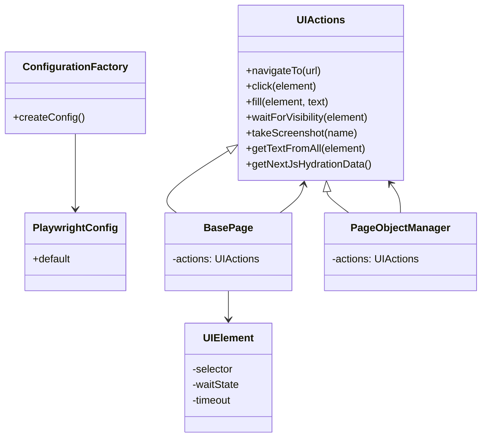
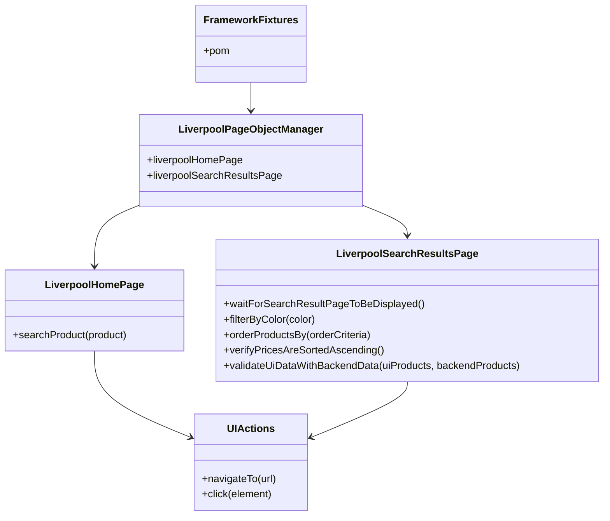

# Playwright Test Automation Core Framework

A reusable Playwright automation core built in TypeScript. This repository contains a core package that encapsulates UI actions, page management, and fixtures, and also includes a `test/` folder that simulates a consumer project using this framework.

---

## What this project is

This repository is both:

1. A **reusable framework** (`src/`) that can become an independent npm package.
2. A **simulated consumer project** (`test/`) that demonstrates how to use the framework from a real test suite.

It shows the separation between reusable core logic and business-specific tests.

---

## Why it is reusable

* `src/` contains framework logic:
  * `core/` → UI actions (`UIActions`), synchronization, helpers.
  * `fixtures/` → Playwright fixture extension exposing `pom`.
  * `pages/` → base page objects and page manager.
  * `types/` → shared typings.
  * `utils/` → shared support utilities.
* `package.json` is configured to compile with TypeScript and expose the package via `exports`.
* `@playwright/test` is defined as a `peerDependency`, which is correct for a framework that integrates with Playwright without forcing a runner version.

This design allows another repository to consume the framework as a dependency and use its fixtures, page objects, and utilities.

---

## How it is used in this repository

The `test/` folder acts as an example consumer:

* `test/fixtures/framework-fixture.ts` extends Playwright with the `pom` fixture.
* `test/pages/` contains `LiverpoolHomePage` and `LiverpoolSearchResultsPage`.
* `test/specs/takeHomeChallengeTests.spec.ts` uses `test` and `pom` to execute a clear flow of search, filter, and validation.
* `test/setup/constants.ts` stores filter and sorting values.

This demonstrates how a consumer can build business logic on top of the framework core.

---

## Overall architecture

### Framework structure (`src`)

```text
src
├── core
│   ├── ui-actions.ts
│   ├── ui-element.ts
│   └── index.ts
├── fixtures
│   ├── framework-fixture.ts
│   └── index.ts
├── pages
│   ├── base-page.ts
│   ├── page-object-manager.ts
│   └── index.ts
├── types
│   ├── fixtures.types.ts
│   └── index.ts
└── utils
    └── configuration-factory.ts
```



The framework core provides UI synchronization, reusable action helpers, a typed fixture wrapper, and a base page manager. It does not include consumer-specific pages or business selectors.

### Consumer example structure (`test`)

```text
test
├── fixtures
│   └── framework-fixture.ts
├── locators
│   ├── common-page.locators.ts
│   ├── liverpool-home-page.locators.ts
│   └── liverpool-search-results-page.locators.ts
├── pages
│   ├── common.page.ts
│   ├── liverpool-home.page.ts
│   ├── liverpool-search-results.page.ts
│   └── page-object-manager.ts
├── setup
│   ├── constants.ts
│   ├── custom-setup.ts
│   ├── custom-teardown.ts
│   └── liverpool-page-object-manager.ts
└── specs
    └── takeHomeChallengeTests.spec.ts
```



The consumer example defines its own Page Object Manager, business page objects, locators, and spec flow. It consumes the framework's fixture and action engine, but retains all business-specific behavior in `test/`.

## Example consumer code

### 1. Consumer `playwright.config.ts`

This repo uses a lightweight config that delegates to the framework factory.

```ts
import { ConfigurationFactory } from '@playwright-framework/fs';

export default ConfigurationFactory.createConfig();
```

A consumer can also generate a fresh config with Playwright and override it as needed:

```bash
npx playwright init
```

Then modify `playwright.config.ts` to extend or replace the default settings.

### 2. Consumer test wrapper

The consumer creates a simple wrapper using the framework helper.

```ts
import { createFrameworkTest } from '@playwright-framework/fs';
import { LiverpoolPageObjectManager } from './setup/liverpool-page-object-manager';

export const test = createFrameworkTest(LiverpoolPageObjectManager);
```

### 3. Consumer Page Object Manager

The consumer manager exposes page objects as typed properties.

```ts
import { PageObjectManager } from '@playwright-framework/fs';
import { LiverpoolHomePage, LiverpoolSearchResultsPage } from '../pages/index.js';

export class LiverpoolPageObjectManager extends PageObjectManager {
  private _liverpoolHomePage?: LiverpoolHomePage;
  private _liverpoolSearchResultsPage?: LiverpoolSearchResultsPage;

  get liverpoolHomePage() {
    return this._liverpoolHomePage ??= new LiverpoolHomePage(this.actions);
  }

  get liverpoolSearchResultsPage() {
    return this._liverpoolSearchResultsPage ??= new LiverpoolSearchResultsPage(this.actions);
  }
}
```

### 4. Consumer Page Objects and locators

The consumer keeps page objects and locators separate. Example:

```ts
// test/pages/liverpool-home.page.ts
import { LiverpoolHomePageLocators } from '../locators/liverpool-home-page.locators.js';
import { CommonPage } from './common.page.js';
import { UIElement } from '@playwright-framework/fs';

export class LiverpoolHomePage extends CommonPage {
  protected get searchInput() {
    return new UIElement(LiverpoolHomePageLocators.searchInput);
  }

  async searchProduct(product: string) {
    await this.actions.fill(this.searchInput, product);
    await this.actions.pressKey(this.searchInput, 'Enter');
  }
}
```

```ts
// test/pages/common.page.ts
import { BasePage, ElementTimeout, PlaywrightWaitState, UIElement } from '@playwright-framework/fs';
import { CommonPageLocators } from '../locators/common-page.locators.js';

export class CommonPage extends BasePage {
  public get liverpoolImage() {
    return new UIElement(CommonPageLocators.liverpoolImage, PlaywrightWaitState.VISIBLE, ElementTimeout.LONG);
  }

  async navigateToHomePage(): Promise<void> {
    await this.actions.navigateTo('https://www.liverpool.com.mx/');
    await this.actions.waitForVisibility(this.liverpoolImage);
  }
}
```

```ts
// test/specs/takeHomeChallengeTests.spec.ts
import { test } from '../fixtures/framework-fixture.js';
import { COLOR_FILTERS, ORDER_BY_OPTIONS } from '../setup/constants.js';

test.describe('Take home challenge - Data Driven E2E Suite', () => {
  test.beforeEach(async ({ pom }) => {
    await pom.liverpoolHomePage.navigateToHomePage();
  });

  test('E2E UI Automation - Search, Filter and Sort', async ({ pom }) => {
    await pom.liverpoolHomePage.searchProduct('playstation 5');
    await pom.liverpoolSearchResultsPage.waitForSearchResultPageToBeDisplayed();
    await pom.liverpoolSearchResultsPage.filterByColor(COLOR_FILTERS.WHITE_COLOR_FILTER);
    await pom.liverpoolSearchResultsPage.orderProductsBy(ORDER_BY_OPTIONS.ORDER_BY_LOWEST_TO_HIGHER_PRICE_OPTION);
  });
});
```

This shows how a consumer project can:

* define its own config or reuse the framework config factory,
* create a wrapper test helper with `createFrameworkTest`,
* implement a custom Page Object Manager,
* keep page objects and locators separate,
* write clean business tests consuming `pom`.

---

## What this repo proves today

* The package can build successfully with `npm run build`.
* The core architecture is reusable and decoupled.
* Business tests can be written cleanly and readably.
* Execution is delegated to Playwright native CLI behavior, not a custom runner.

---

## Running and using Playwright

This project does not implement a custom runner. It uses Playwright native commands.

### Initial setup

```bash
npm install
npx playwright install
```

### Run tests

```bash
npx playwright test
```

### Default behavior

* `npx playwright test` runs in headless mode by default.
* Adding `--headed` runs in headed mode.
* You can also use `--workers`, `--project`, `--grep`, and other native Playwright options.

### Examples

```bash
npx playwright test --headed
npx playwright test --workers=2
npx playwright test --project=chromium
```

> Note: By default `npx playwright test` runs headless. Passing `--headed` opens the browser visually. This project follows standard Playwright behavior without changing it.

---

## Build and packaging

To compile the framework and generate `dist/` artifacts:

```bash
npm run build
```

This command cleans `dist` and runs `tsc`.

---

## Current status

* The package is not published yet, but the structure is consistent with a reusable npm package.
* The `test/` example acts as a reference consumer.
* The solution is aligned with Playwright and does not require a custom shell to run tests.

---

## CI pipeline overview

This repository includes a GitHub Actions workflow at `.github/workflows/test.yml` that runs the Playwright suite on every dispatch.

### Pipeline flow

1. **Checkout code**
   * Uses `actions/checkout@v5` to fetch the repository.

2. **Setup Node.js**
   * Uses `actions/setup-node@v5` with Node.js `24`.
   * Caches npm dependencies for faster rebuilds.

3. **Install dependencies**
   * Runs `npm ci` to install exact package versions from `package-lock.json`.

4. **Restore Playwright browser cache**
   * Uses `actions/cache@v5` to restore `~/.cache/ms-playwright` if a previous run already saved it.
   * This avoids re-downloading browsers when the cache is available.
   * The cache is retained for 7 days, so it can be reused across runs in that window.

5. **Install Playwright browsers if needed**
   * Runs `npx playwright install --with-deps --no-shell` only when the cache was not restored.
   * If the cache exists, this step is skipped and the workflow is much faster.

6. **Save Playwright browser cache when missing**
   * Uses `actions/cache@v5` to upload `~/.cache/ms-playwright` after install, only when the cache was not already present.
   * The cache is retained for 7 days, so future runs can restore it without re-downloading browsers.
   * This makes future CI runs faster by reusing the browser binaries.

7. **Run Playwright tests**
   * Runs `npx playwright test`.
   * This executes the same test command used locally, so the CI behavior mirrors developer execution.

6. **Publish JUnit results**
   * Uses `dorny/test-reporter@v3` to publish `reports/junit/junit-report.xml`.
   * The publisher does not fail the job on reporting errors.

7. **Upload Playwright report artifact**
   * Uses `actions/upload-artifact@v7` to upload the `reports/playwright-report/` folder.
   * The artifact is kept for 30 days.

### Workflow inputs

The workflow supports runtime inputs when manually triggered:

* `workers` — number of parallel workers (default `1`).
* `retries` — number of test retries on failure (default `0`).

These inputs are exposed through GitHub Actions workflow dispatch and can be used to tune CI execution.

### Why it matters

The pipeline shows that this project is CI-ready and that the framework can be validated automatically in a clean environment. It also documents the intended CI flow: install dependencies, install Playwright browsers, run tests, and publish results.
